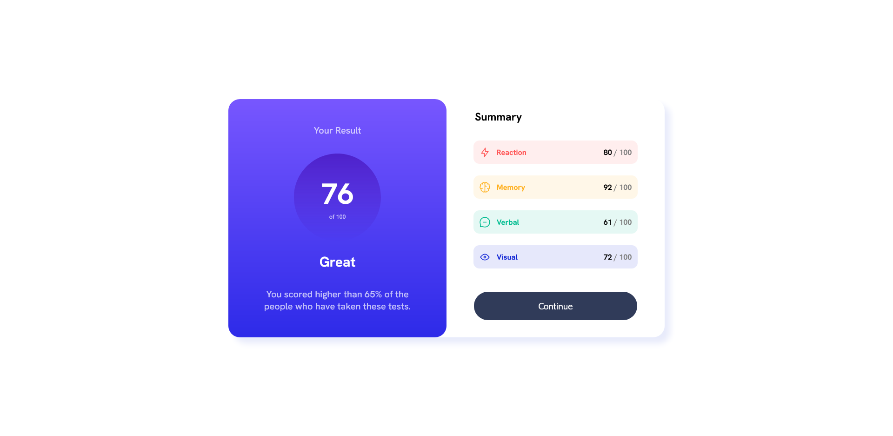
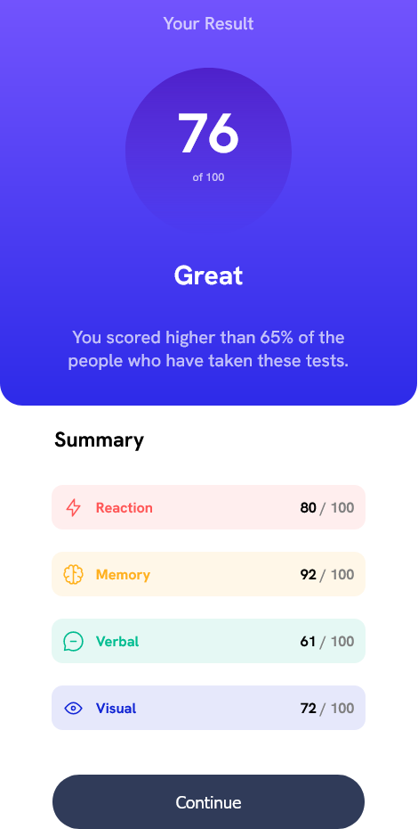

# Frontend Mentor - Results summary component solution

This is a solution to the [Results summary component challenge on Frontend Mentor](https://www.frontendmentor.io/challenges/results-summary-component-CE_K6s0maV). Frontend Mentor challenges help you improve your coding skills by building realistic projects.

## Table of contents

- [Overview](#overview)
  - [The challenge](#the-challenge)
  - [Screenshot](#screenshot)
  - [Links](#links)
- [My process](#my-process)
  - [Built with](#built-with)
  - [What I learned](#what-i-learned)
  - [Useful resources](#useful-resources)
- [Author](#author)

**Note: Delete this note and update the table of contents based on what sections you keep.**

## Overview

### The challenge

Users should be able to:

- View the optimal layout for the interface depending on their device's screen size
- See hover and focus states for all interactive elements on the page

### Screenshot

### Links

- Solution URL: [Frontend Mentor Solution](https://www.frontendmentor.io/solutions/results-summary-component-with-html-and-css-FYs4YINCkt)
- Live Site URL: [Results Summary Component](https://drangam9.github.io/results-summary-component/)

## My process

### Built with

- Semantic HTML5 markup
- CSS custom properties
- Flexbox

### What I learned

This project taught me how to add an outside font to the css and use its different weights. I also learned how to change css depending on the screen width \, thus making the card responsive.

### Useful resources

- [Responsive Cards](https://www.w3schools.com/howto/howto_css_column_cards.asp) - This W3Schools lesson helped me make the card responsive.
- [Font Weights](https://stackoverflow.com/questions/28279989/multiple-font-weights-one-font-face-query) - This Stack Overflow question helped me declare different font weights to the css file.

## Author

- Website - [drangam9](https://github.com/drangam9)
- Frontend Mentor - [@drangam9](https://www.frontendmentor.io/profile/drangam9)
